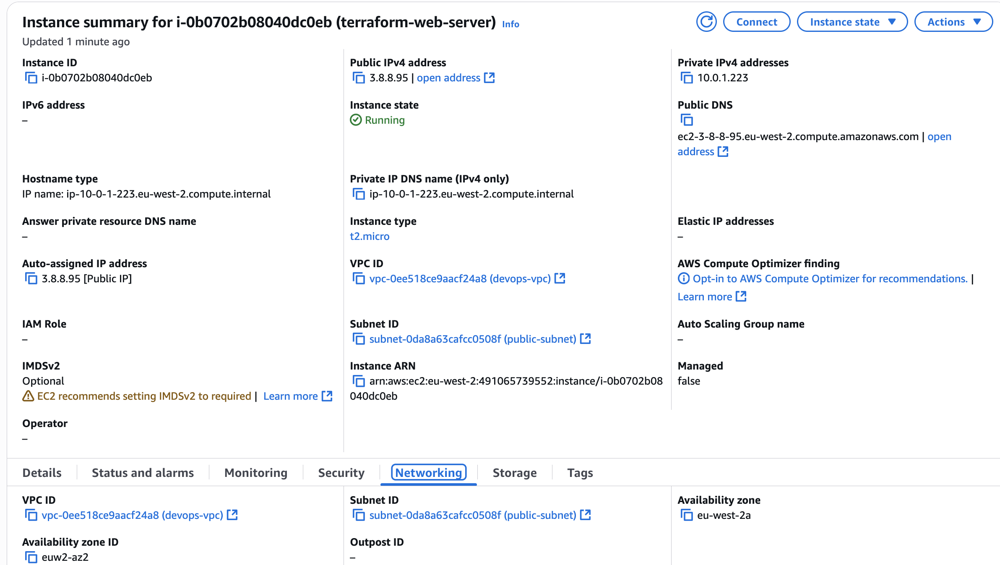
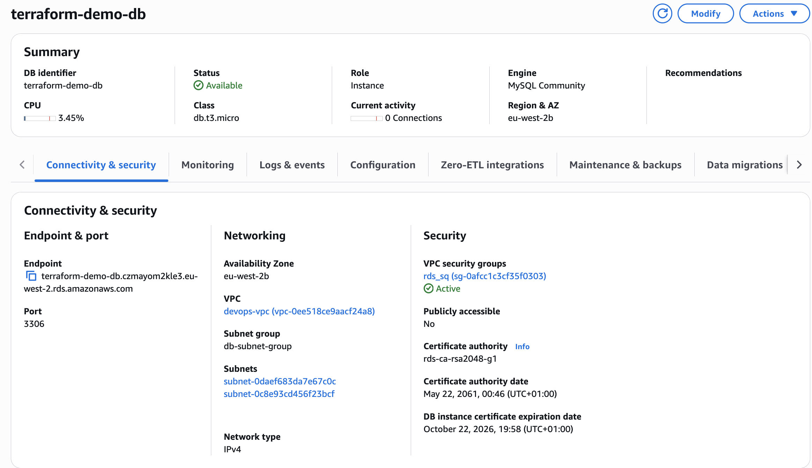

# Terraform AWS Infrastructure-as-Code Project

## 📘 Overview
This project demonstrates a **production-style AWS environment** built entirely using **Terraform Infrastructure-as-Code (IaC)**.  

It provisions a **custom VPC**, **public/private subnets**, a **web server (EC2)**, and a **relational database (RDS MySQL)** — all automated through reusable Terraform configurations.

---

## 🎯 Objectives
- Build a secure, scalable AWS environment using Terraform.  
- Deploy a **3-tier architecture** (Network → Compute → Database).  
- Showcase core DevOps and AWS cloud skills through IaC automation.  

---

## 🧩 Architecture Overview
**Architecture Components:**
- **VPC** with CIDR `10.0.0.0/16`
- **Public Subnet** (EC2 web server)
- **Private Subnets** (RDS database)
- **Internet Gateway** and **Route Tables**
- **EC2 Instance** with Apache Web Server
- **RDS MySQL Instance** (private, multi-AZ ready)
- **Security Groups** for controlled network access

---

## ⚙️ Technologies Used
| Tool | Purpose |
|------|----------|
| **Terraform** | Infrastructure as Code (IaC) |
| **AWS VPC** | Custom networking environment |
| **AWS EC2** | Web application host |
| **AWS RDS (MySQL)** | Managed database service |
| **AWS Security Groups** | Network-level access control |
| **AWS CLI** | Infrastructure management |

---

## 📁 Project Structure

```bash
terraform-aws-iac/
├── provider.tf
├── versions.tf
├── vpc.tf
├── ec2.tf
├── rds.tf
├── outputs.tf
├── variables.tf
└── .gitignore

```
---

## 🚀 Deployment Instructions

### 1️⃣ Initialise Terraform
```bash
terraform init
```
### 2️⃣ Format and Validate
```bash
terraform fmt
terraform validate
```
### 3️⃣ Plan Infrastructure
```bash
terraform plan
```

### 4️⃣ Apply Changes
```bash
terraform apply
```
### 5️⃣ Output Example
```bash 
Apply complete! Resources: 10 added, 0 changed, 0 destroyed.

Outputs:
vpc_id = "vpc-0ee518ce9aacf24a8"
ec2_public_ip = "3.8.8.95"
rds_endpoint = "terraform-demo-db.czmayom2kle3.eu-west-2.rds.amazonaws.com"
```

## AWS Console Verification

### EC2 Instance

Below is the deployed EC2 instance visible in the AWS Console:



### RDS Database

Below is the RDS MySQL instance created via Terraform:



## Security Design

RDS is deployed in private subnets (no public access).

EC2 is the only allowed inbound source to the DB.

Security Groups define strict ingress/egress rules.

Terraform state excluded via .gitignore (to protect credentials).

## Key Learning Outcomes

- Learned to provision full AWS infrastructure via Terraform
- Understood AWS networking fundamentals (VPC, subnets, routing)
- Automated EC2 + RDS deployments

## Future Improvements

- Add CloudWatch monitoring for EC2 and RDS.

- Implement Terraform modules for better code reuse.

- Deploy load balancer (ALB) and auto-scaling groups.

- Integrate with GitHub Actions for CI/CD automation.